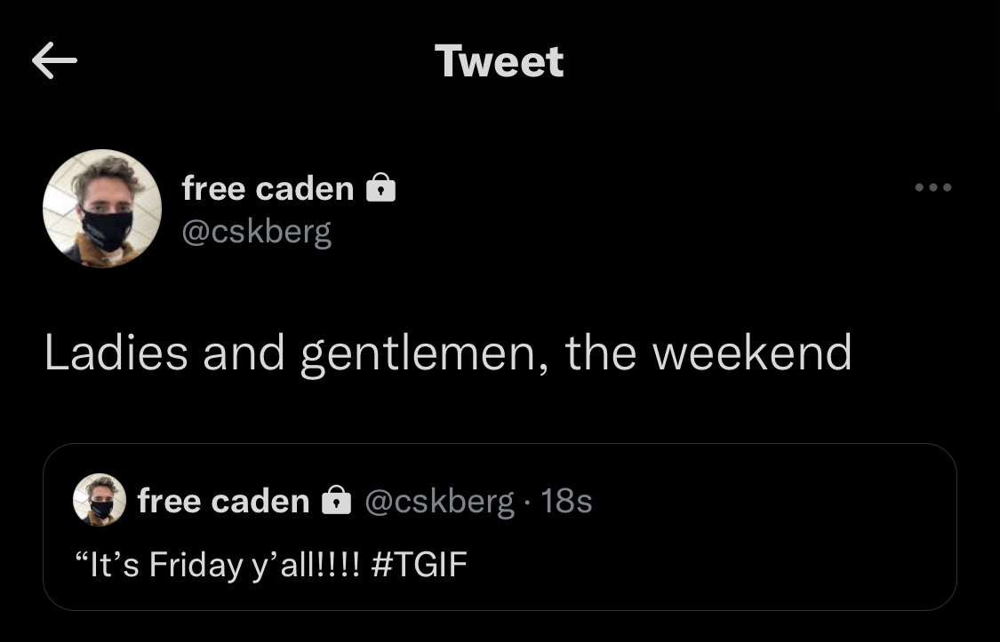

# auto-tweeter

Twitter bot designed to tweet things daily for the user.

## Initialization ##

To get the bot started, navigate to the directory you want the project stored, clone the repository, and install the requirements
```
git clone https://github.com/cskroonenberg/auto-tweeter
cd auto-tweeter
pip3 install -r requirements.txt
```
Once that's done, you'll need to set up a [Twitter](https://twitter.com/cskberg) profile (if you don't already have one). Feel free to give me a follow if you want ;) .

Then follow the steps at this [link](https://developer.twitter.com/en/docs/twitter-api/getting-started/getting-access-to-the-twitter-api) to get access to Twitter API keys (make sure these keys grant read and write access. See more [here](https://developer.twitter.com/en/docs/apps/app-permissions)).

After you have your API keys, it's <i>almost</i> time to get Tweeting. But first, run the following command:
```
python3 init_bot.py
```
This script will ask you a few questions like:
* What is your Twitter username?
* Do you want tweet sounds to play when tweets are sent?

It will also ask you for your Twitter API keys. All this information will be all stored in files in the data directory, they are <b>not</b> uploaded anywhere.

Almost done!

Running that script will have created a file called ``tweets.csv``. Edit this file to with content for tweets (see below). The bot will Tweet the thing at the top of this file (and then subsequently remove that line from the file after the Tweet has been sent). Make sure it's you come back to it often to keep adding new messages!
```
#tweets.csv
Throwback Thursday!!!! Can't wait for Thursday Night Football.
It's Friday y'all!!!! #TGIF
Ladies and gentlemen, the weekend
```
Each of these rows will be used for tweets.
The final result should look like this:

One tweet will be tweeted a day. As you can see, the tweet referring to Friday has been Quote Retweeted by the tweet referring to Saturday. (You may also notice that screenshot says 18s on the Quoted Tweet from Friday, this will say 1d when used in production, I just needed to quickly make a screenshot with the sample Tweets I made for this README)

## Execution ##

So how do you run the program? Using the following command:
```
python3 bot.py
```
Will send out a tweet every day at 12:00 PM (based on system time). However! Be aware that the program must be kept running to send tweets out every day. The best method that I have found is to just run that program on a Raspberry Pi or something which can be left running 24/7 (NOTE: whatever device you run the program on must have an internet connection).

Alternatively, you could execute the following command every day, manually:
```
python3 tweeter.py
```

## Tools ##

I created the `fetch_tweets.py` script to fetch your most recent 25 tweets as well as the IDs of your most recent tweets. This can be helpful for development purposes.
```
python3 fetch_tweets.py
```
Tweets are logged in a file called `log.json`. This can be found in the `data` directory. Tweet content, Tweet ID, Quote Tweet ID, and date-time of tweet are logged.
